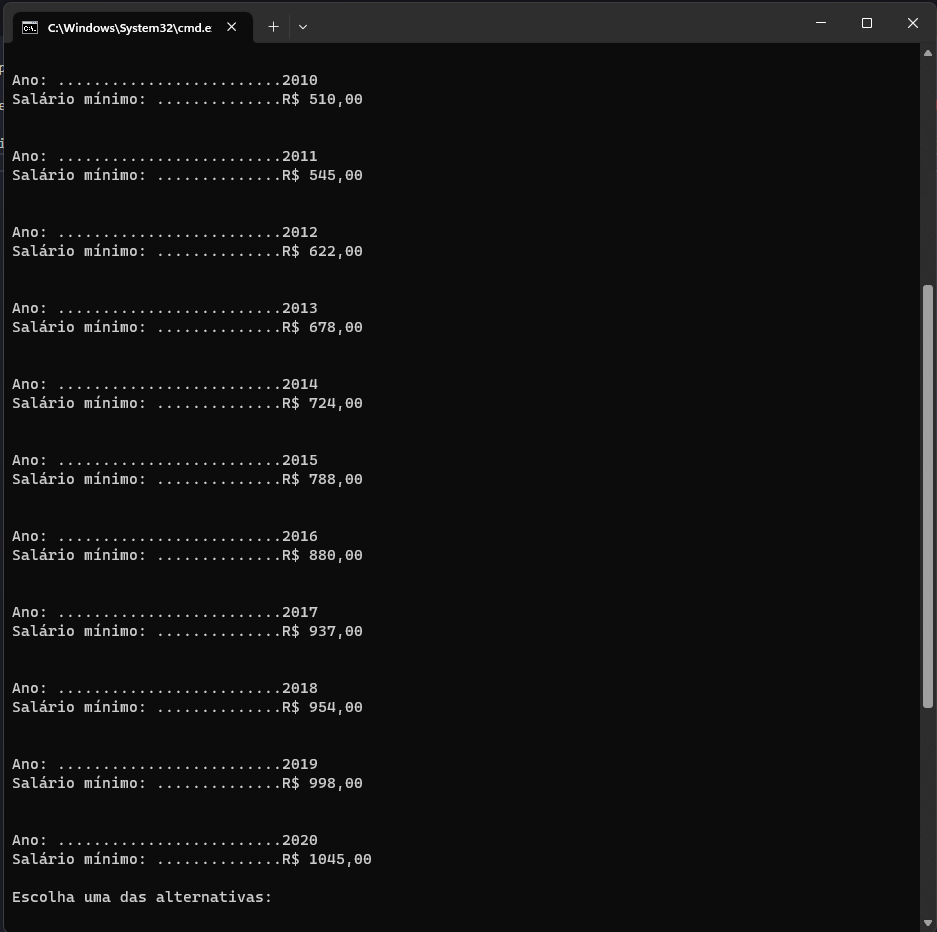

Olá, bem-vindo ao projeto comparação de salário e inflação!

Este projeto foi feito pondo em prática os conceitos de arrow function, manipulação de strings, arrays, estrutura de repetição, inputs, estruturas condicionais e tipos de dados.

A proposta desse projeto é criar um sistema que liste o salário mínimo e a inflação do IPCA entre 2010 e 2020. Além disso, a aplicação deve listar um comparativo do percentual de crescimento desses dois valores nesse mesmo período.

Para iniciar o programa, instale o Node.js em sua máquina. Em seguida, abra o promt de comandos no caminho do diretório do projeto e digite o seguintes comandos: chcp 65001 (para que o promt de comandos possa ler os caracteres da biblioteca de input com acento) e depois node index.js, conforme a imagem abaixo:

Ao abrir o programa, aparecerá um menu com 4 opções, você deve escolher a que desejar:

Caso digite qualquer outra informação que não sejam as quatro presentes no menu, o programa irá pedir para digitar uma opção válida:

A primeira opção apresenta os salários mínimos do ano de 2010 á 2020:

A segunda opção apresenta o índice de IPCA do ano de 2010 á 2020:

A terceira opção aprensenta a comparação entre o percentual de aumento salarial e o IPCA:

Por fim, a quarta opção finaliza o programa:

